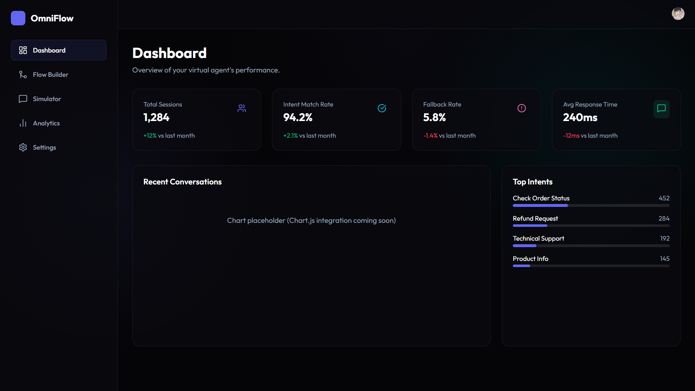

# OmniFlow CX

**Free-Tier Contact Center AI Simulation System**

OmniFlow CX is a powerful, web-based platform designed to build, test, and simulate enterprise-grade conversational AI flows without the enterprise price tag. Powered by Google's Vertex AI and Gemini models, it offers a visual interface for designing complex conversation paths and analyzing their performance.



## 🚀 Features

-   **Vertex AI Powered**: Leverage Google's Gemini Flash Lite models for state-of-the-art intent classification and natural language response generation.
-   **Visual Flow Builder**: Design complex conversation paths with an intuitive drag-and-drop interface, similar to Dialogflow CX.
-   **Real-time Simulator**: Test your agents in real-time with a built-in chat simulator to verify intent matching and flow logic.
-   **Analytics Dashboard**: Track key metrics such as intent hits, fallback rates, and session duration with integrated analytics.
-   **Secure Authentication**: Enterprise-ready authentication and user management powered by Clerk.
-   **Responsive Design**: Fully responsive interface that works seamlessly on desktop and mobile devices.

## 🛠️ Tech Stack

-   **Framework**: [Next.js 14](https://nextjs.org/) (App Router)
-   **Language**: [TypeScript](https://www.typescriptlang.org/)
-   **Styling**: Vanilla CSS (with CSS Variables & Glassmorphism)
-   **Authentication**: [Clerk](https://clerk.com/)
-   **AI/LLM**: [Google Vertex AI](https://cloud.google.com/vertex-ai) (Gemini Models)
-   **Database**: [Firebase](https://firebase.google.com/) (Firestore) / BigQuery (Analytics)
-   **Icons**: [Lucide React](https://lucide.dev/)

## 🏁 Getting Started

### Prerequisites

-   Node.js 18+ installed
-   A Google Cloud Platform (GCP) project with Vertex AI API enabled
-   A Clerk account for authentication
-   A Firebase project (optional, for persistence)

### Installation

1.  **Clone the repository**
    ```bash
    git clone https://github.com/yourusername/omni-flow-cx.git
    cd omni-flow-cx
    ```

2.  **Install dependencies**
    ```bash
    npm install
    ```

3.  **Environment Setup**
    Create a `.env.local` file in the root directory and add your keys:

    ```env
    NEXT_PUBLIC_CLERK_PUBLISHABLE_KEY=pk_test_...
    CLERK_SECRET_KEY=sk_test_...
    
    # Google Cloud / Vertex AI Credentials (if using server-side auth)
    GOOGLE_APPLICATION_CREDENTIALS=path/to/service-account.json
    ```

4.  **Run the development server**
    ```bash
    npm run dev
    ```

    Open [http://localhost:3000](http://localhost:3000) with your browser to see the result.

## 📂 Project Structure

```
src/
├── app/                # Next.js App Router pages and layouts
│   ├── dashboard/      # Protected dashboard routes
│   ├── layout.tsx      # Root layout with Clerk provider
│   └── page.tsx        # Landing page
├── components/         # Reusable React components
│   ├── Sidebar.tsx     # Dashboard navigation
│   └── ...
├── middleware.ts       # Clerk authentication middleware
└── styles/             # Global styles (globals.css)
```

## 🤝 Contributing

Contributions are welcome! Please feel free to submit a Pull Request.

## 📄 License

This project is licensed under the MIT License - see the [LICENSE](LICENSE) file for details.
